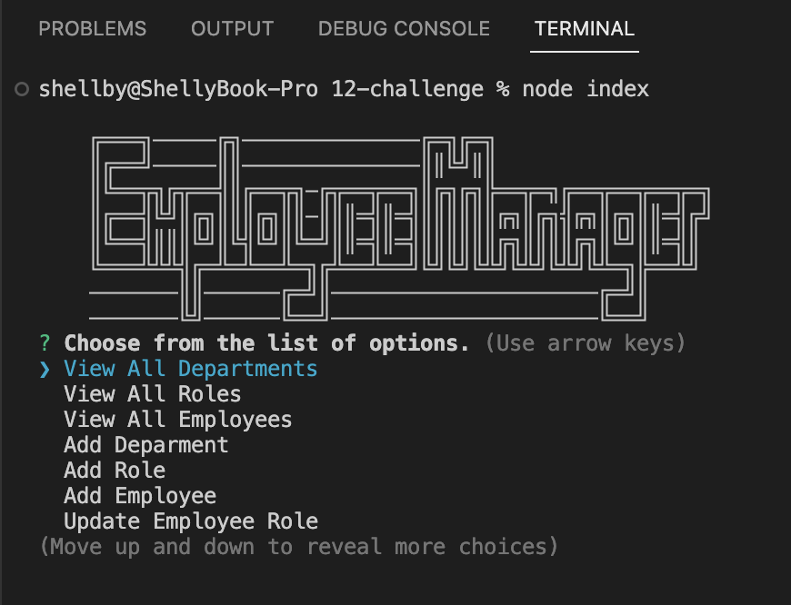

# Shellbys-Employee-Tracker

## Description

Shellbys-Employee-Tracker is a command-line application powered by `node.js`, `inquirer`, and `MySQL` that allows the user to manage a company's employee database.

## Table of Contents
* [Installation](#installation)
* [Usage](#usage)
* [Application Demo ](#application-demo)

## Installation

To create your own note employee-tracker app, `git clone` the repo so you have the project on your local development environemnt.

Run `npm init -y` in the terminal to create a package.json file to store dependencies.

`npm i` to install your NPM package manager and required dependencies.

`npm i inquirer` to interact with the user through command-line.

`npm i console.table` to print MySQL rows to console.

`npm mysql2` to connect to your MySQL data and perform queries.

`MySQLWorkbench` to view database in GUI.

Run `mysql -u -root -p` to initialize MySQL, then enter the `username` and `password` to login.

## Usage
Run `node index` to start application and answer the prompts.

Follow the prompts for each selection.

Select `Exit` to quit.

## Application Demo

The following images capture Shellby-Employee-Tracker application and functionality:

Use the following link to find the application demo video:
https://drive.google.com/file/d/1MuNKDXlx2vWxt9o5FAfrNAaxHZWx7tV9/view 

